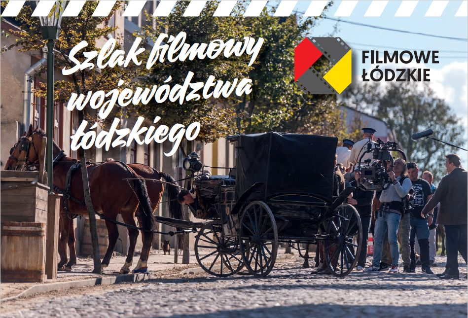

W 2009 r. Stowarzyszenie REGIO rozpoczęło realizację działań związanych z dziedzictwem filmowym. Zrealizowaliśmy wówczas projekt „Szlak dziedzictwa filmowego Łodzi”. 

Rok później ukazał się książkowy [*Przewodnik po filmowej Łodzi*](https://regiocentrum.pl/wydawnictwo/przewodnik-po-filmowej-lodzi/) autorstwa Macieja Kronenberga, Marty Wawrzyniak i Aleksandry Sudowskiej.

Kontynuując te działania w 2014 r. opublikowaliśmy [*Stawkowy przewodnik filmowy*](https://regiocentrum.pl/wydawnictwo/stawkowy-przewodnik-filmowy/) poświęcony plenerom *Stawki większej niż życie*. Była to praca zbiorowa pod redakcją Bogdana Bernackiego, prezesa Klubu Miłośników Stawki, autora książki "Stawka większa niż życie. Serial wszechczasów". Poszczególne rozdziały stworzyli tu Rafał Baćmaga (Płock i Łąck), Bogdan Bernacki (Wrocław i Olsztyn), Arkadiusz Bilecki (Trójmiasto), Leszek Goławski (Kraków i Pieskowa Skała), Maciej Kronenberg (Łódź), Paweł Szczutowski i Joanna Szyborska-Kaszycka (Warszawa).

W 2015 r. wydaliśmy książkę [*Przewodnik filmowy po województwie łódzkim*](https://regiocentrum.pl/wydawnictwo/przewodnik-filmowy-po-wojewodztwie-lodzkim/) autorstwa Macieja Kronenberga.

W 2016 r. w ramach projektu „Szlak filmowy województwa łódzkiego” [Filmowe łódzkie] wydany został [folder turystyczny dotyczący szlaku](https://regiocentrum.pl/media/pages/o-nas/zrealizowane-projekty/potencjal-filmowy-wojewodztwa-lodzkiego/1a2f849e3d-1664362990/szlak-filmowy-wojewodztwa-lodzkiego-web-2022-09-27.pdf)… 

…oraz [eksperckie opracowanie dotyczące potencjału filmowego województwa łódzkiego na tle innych regionów Polski *Potencjał turystyczny dziedzictwa filmowego w województwie łódzkim* stworzone przez Macieja Kronenberga](https://regiocentrum.pl/media/pages/o-nas/zrealizowane-projekty/potencjal-filmowy-wojewodztwa-lodzkiego/368c473929-1596056860/potencjal-turystyczny-dziedzictwa-filmowego-w-woj.-lodzkim_kronenberg_regio-2016.pdf).

 

Z kolei w 2018 r. w ramach projektu "Pociągiem w Filmowe Łódzkie" dofinansowanego ze środków Urzędu Marszałkowskiego w Łodzi przygotowaliśmy trzy foldery o filmowym dziedzictwie [Łowicza](https://regiocentrum.pl/media/pages/o-nas/zrealizowane-projekty/pociagiem-w-lodzkie/b15653b11b-1596203382/folder-filmowe_lowicz.pdf/), [Skierniewic](https://regiocentrum.pl/media/pages/o-nas/zrealizowane-projekty/pociagiem-w-lodzkie/7a63580303-1596203383/folder-filmowe_skierniewice.pdf/) i [Zgierza](https://regiocentrum.pl/media/pages/o-nas/zrealizowane-projekty/pociagiem-w-lodzkie/3dfe990cce-1596203382/folder-filmowe_zgierz.pdf/). Foldery rozdawane były uczestnikom wycieczek, które prowadziliśmy do tych trzech miast, korzystając z pociągów Łódzkiej Kolei Aglomeracyjnej.

W 2021 r. wydaliśmy drugie, rozszerzone wydanie [*Przewodnik po filmowej Łodzi*](https://regiocentrum.pl/wydawnictwo/przewodnik-po-filmowej-lodzi-wydanie-nowe). Zmienił się skład autorów, obok Macieja Kronenberga pojawił się Krzysztof Olkusz. 

Najnowszą książkową publikacją filmową w naszym dorobku jest [*Filmowe Poświętne we wspomnieniach mieszkańców*](https://regiocentrum.pl/wydawnictwo/filmowe-poswietne-we-wspomnieniach-mieszkancow) autorstwa Macieja Kronenberga ze zbiorem wspomnień mieszkańców gminy Poświętne.

W 2024 r. podjęliśmy działania na rzecz ożywienia Szlaku, przygotowując [nowy folder filmowy] (https://regiocentrum.pl/media/pages/aktualnosci/nowy-folder-filmowe-lodzkie/cbc8055094-1727166981/filmowe-lodzkie-2024_10-09-2024.pdf), prezentujący plenery filmowe województwa łódzkiego z ostatniej dekady.

